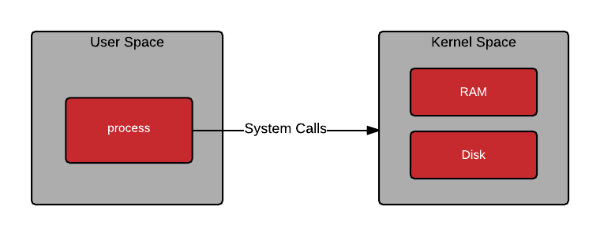
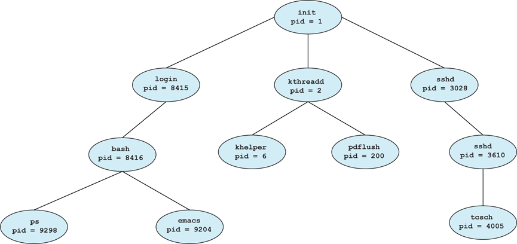
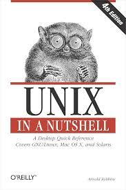
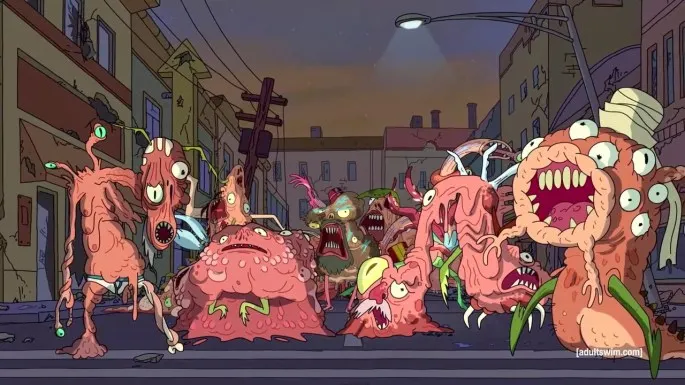

# Introduction to Shells

SSgt Clark, Athan L

_Presented on 20251223_

---

# SSgt Clark

Platoon Sergeant
3D Network Battalion, Detachment Hawaii

- Software Developer for ~15 Years
- Software Engineering & Computer Science Enthusiast
    - Working Toward Degree and PE Licensure
- CompTIA A+, Net+, Sec+, CySA+
- Google Data Analytics, Professional Scrum Master Level 1
- Lean Six Sigma Yellow Belt

---

## Outline

<small>

1. Introduction
2. Why Shells Exist
2. UNIX Shells
    1. Paradigm
    2. Environment Variables
    3. Commands and Executables
    4. Processes and Initialization
    5. Jobs
    6. Pipes and File Descriptors
3. 

</small>

---

## Introduction

> The shell is the user’s programming language.

— Rob Pike

> The UNIX shell is a programming language in which commands are first-class objects.

— Brian Kernighan

---



## Why Shells Exist

O/S Kernel Manages Execution of Processes
- Makes the Hardware actually do things
- Processes ask the Kernel to do things through System Calls
- How do I start a new process?

---



## Why Shells Exist

Processes can start new processes with `fork()`

- All starts with `init` processes on boot
- Typically starts login program, which starts interactive system (shell)
- Shell is a general-purpose process that can start arbitrary processes

---

## Why Shells Exist

Called a "shell" because it wraps the kernel (kinda)

Shell interaction via a _terminal_, commonly as a _tele-type_ (TTY)

Most shells support scripting - repeatable interactions captured in a file, interpreted by the shell program

O/S User Interfaces are "Graphical Shells"

---

## UNIX Shells



UNIX Philosophy - a program should do one thing and do it well, and should work well with other programs

Shells employ these programs together to accomplish tasks

---

## UNIX Shells - Paradigm

- A process is a running program, started by a command
- Commands are just executable files
- Parameters can be passed to commands on their invocation
- Processes can use its environment for context
- Environments are Inherited by Sub-Processes
- Processes are started by a user and group, inherit those permissions
- Processes have a standard input, standard output, and standard error, each as streams of text

---

## UNIX Shells - Paradigm

- A "shell" can mean a specific implementation of a shell (BASH, KSH, FISH), or a running process of a specific implementation
    - i.e., "This shell supports background jobs while this one doesn't" vs. "Open up a new shell"
- A shell is a process that can start arbitrary processes
- A shell has a _current working directory_ location in the filesystem
- A shell is operated by a user and group, which the processes it starts inherits
- A shell can send signals to processes (`Ctrl^C` for SIGINT, `Ctrl^D` for EOF, `kill`, etc.)

---

## UNIX Shells - Environment Variables

<small>

Automatically passed to child processes

```sh
SOME_VARIABLE="foo"
echo $SOME_VARIABLE
```

Use of `$` in an expression _dereferences_ the varaible

Use of `env` command displays all ENVVARs. Important variables:

| Variable | Use |
| :---- | :---- |
| $HOME | Location of current user's home directory |
| $PWD | Current working directory of the shell |
| $PATH | Location of searchable directories for finding a command |

</small>

---

## UNIX Shells - Commands

Some commands are built-in to a shell (i.e. `cd` for change directory), others are outsourced

Shell uses `$PATH` to search for the executable of a command - `which <some_command>` tells you where that exectuable is

When the shell runs a command, it actually forks its processes, and assigns that executable as the process's code to the Kernel - it's now the Kernel's problem

Shell will pause execution until command completes

---

## UNIX Shells - Processes

- Process #1 is `init` when system boots
    - Starts all other essential processes to make operating system useful
- Processes `fork` other processes in order to run new programs
- All of this is inspectable with `htop` (basically task manager)
- Some processes can have priority systems for execution, some kernels support real-time (RT) execution (mandatory time scheduling)
- Each process has an owner, a working directory, and an environment

---

## UNIX Shells - Jobs

Usually where shells differ the most, outside of syntax

A process can receive a signal (`Ctrl^Z`) that pauses its execution and return to the shell. The shell can choose to continue its execution in the background or foreground.

- It gets a little tricky when redirecting its file descriptors

Some shells (ksh, mksh) support multiple parallel job scheduling

---

## UNIX Shells - File Descriptors

<small>

Kernel gives each process a Standard Input, Standard Output, and Standard Error (STDIN, STDOUT, STDERR)

If process is bound to a terminal, the STDIN comes from the keyboard, and STDOUT/STDERR go to the terminal screen - example:

```hs
main :: IO ()
main = do
  theInput <- getLine -- from stdin
  putStrLn ("This was what you input: " ++ theInput) -- to stdout
```

</small>

---

## UNIX Shells - Pipes

Plumbs one command's STDOUT to another command's STDIN

```sh
going_out | coming_in
```

Typically see chains of operations

```sh
outputs_a_lot_of_text | grep "^some_search_expression$" | sort | head
```

---

## UNIX Shells - Pipes

`cat` outputs all of a file's contents to STDOUT

```sh
cat somebigfile.txt
```

Also outputs whatever's plumbed into its STDIN

```sh
echo "this will get repeated" | cat
```

`|` and `cat` form a monoid over process inputs and outputs

---

# Are We Good?

---

# Are We Good?

## Cool.

---

# Are We Good?

## Cool.

### Run through UNIX Shells again for good measure

---



## Cons of UNIX Shells

<small>

- Modern UNIX ecosystem is a Cronenberg of disorganized individuality
- STDIN/STDOUT data is restricted to Strings
- Safe translation of piped data to command arguments typically requires a parsing system like `awk` or `perl`, or you're better off writing a script in Python or something.

</small>

---

## PowerShell

Microsoft's Answer to the Constant Criticism of DOS Command Prompt

Still Microsoft in-nature (🤮)

- .NET / C# syntax (caps convention, caps insensitive)
- Restricted to Commands (Cmdlets) written in C# / .NET
- No robust job support
- Needed to invent new syntax to make up for conflicts with other systems

---

## PowerShell

Things it did right

- _Verb_-_Noun_ Syntax
- Structured data between pipes (.NET objects)
- Object field extraction for arguments (no crazy `xargs`, `perl`, `awk` necessary)
- Each command takes one object at-a-time, no batch paging of text
- Integrated manual (better than UNIX `man` pages)
- Installed on every Windows O/S

---

## Review - What is an Object?

"Classical" OOP

```csharp
public class UserInfo
{
  // properties (things that hold data)
  public string Name {get; set;}
  public int Age {get; set;}
  // byproducts of properties
  public bool IsAdult => Age >= 18;
  // methods - functions that act on the object
  public override string ToString()
  {
    return $"{Name} ({Age})";
  }
}
```

---

## Review - What is an Object?

```csharp
$user = new UserInfo {
  Name = "Clark",
  Age = 33
}

$user.IsAdult // True
$user.ToString() // Clark (33)
```

---

## What Does This Imply?

- Objects Are Rich Collections of Data
- Each Data Component is Explicitly _Typed_

This means that you can't put a sqare peg in a round hole, and it's much easier to find the specific peg that you need

---

## What Does This Imply?

<small>

Commands in PowerShell have to be written in C# / .NET, which makes them compliant to their data type paradigm

This allows commands to share typed data between each other, and make that information inspectable at runtime

```pwsh
Get-Help <some cmdlet>
```

```pwsh
Get-Help <some cmdlet> -Examples
```

```pwsh
Get-Help <some cmdlet> -Detailed
```

```pwsh
Get-Help <some cmdlet> -Property <some argument to that cmdlet>
```

</small>

---

## What Does This Imply?

Searching, Filtering, etc. is not just on text, but on the objects themselves

```pwsh
Get-Process | Where-Object CPU -gt 100
```

`Get-Process` returns objects that have the `CPU` property - we refine the results to include only objects that have their `CPU` property with a value greater than `100`.

---

# We O.K.?

---

# We O.K.?

## Cool.

---

## Pipe Objects as Arguments

Say I have one command that returns objects that have a `Foo` property, which is a string:

```powershell
Get-Foos

Foo
---
abc
def
ghi
...
```

---

## Pipe Objects as Arguments

Now, say I have a command that takes as an argument, `-Foo`, which accepts a string:

```powershell
Get-Help Do-Thing -Parameter Foo

-Foo [<System.String>]
```

---

## Pipe Objects as Arguments

`Get-Foos` can be directly piped into `Do-Thing`, with no other coordination.

```powershell
Get-Foos | Do-Thing
```

---

## Pipe Objects as Arguments

You can also use a `ForEach-Object` loop if the names do not match up, but you want precise control:

```powershell
Get-Foos | ForEach-Object {
  Run-Some-Command -NotFoo $_.Foo
}
```

`$_` references the object being looped over.

---

## Pipe Objects as Arguments

If you want, you can turn the value into a string, but this isn't recommended because it removes the type information and makes it the same as UNIX:

```powershell
Get-Foos | Select-Object -ExpandProperty Foo | Run-Some-Command -NotFoo
```

This will assume that the _next position_ in `Run-Some-Command -NotFoo` is where the data goes (just a string)

---

## Pipe Objects as Arguments

PowerShell almost never uses `stdin` or `stdout` - the pipe system / argument positioning is the primary mechanism for information sharing.

---

# How are we holding up?

---

# How are we holding up?

## Cool.

---

## Honorable Mentions

- `ksh` is used as the default shell for OpenBSD (used in a lot of Networking equipment)
- `nushell` has structured data like PowerShell, but isn't plagued by the scourge that is Microsoft
- `fish` friendly, interactive shell - useful for getting help while using a shell
- `zsh` extremely extensible

---

## Conclusion


> Shells are a means to interact with and control a computer in a way that can be automated.

Slides are available at [github.com/athanclark/usmc-presentation-shells-20251230](https://github.com/athanclark/usmc-presentation-shells-20251230)

---

# Vote on Next Topic

1. Proxmox Virtualization System
    - great for home labs
2. Haskell
    - drink the kool-aid
3. Cryptography
    - Ḣ̯ͦ͜ͅi̿ͦ͗̚͢d̨͍̦ͤ͘e̖̭̋̍̿ ̴̙̤ͣ̈́y̷̏ͬ͢͞o̯̯ͫͫ̏u͇̱͊ͨ͡r͖̜͈̿͘ ͉̆̋̋̒s̫͌͘͘͞ĕ̸̸͚̖ċ̶̓͆͘r̶̺̓ͬ͜e͖̼ͯ̿̽t͖ͤͪ̂͑s̭ͨͥͧ͟ ͍̳ͩ̀̊i̞̠̘̎̏n̷̙̣̤̔ ̲̃͑̓͑p҉͉̜̆ͩl̷ͭ̉͋̆a̸̢̡͆̐i͍̎̽͋͞ṇ̡̘̝͟ ̹̇̅́͝s̥ͤ͋͢͠i̥̯̾͆ͬg̣̓̐̌̕h͓͖̰̅̌t͎̮̘ͥ͘
4. GNU/Linux
    - This one won't get you anywhere, but you'll be able to say that you were made aware of some things

---

# Questions / Comments
