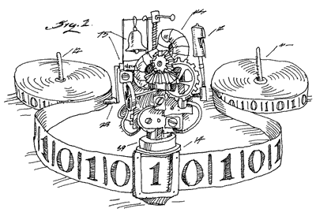
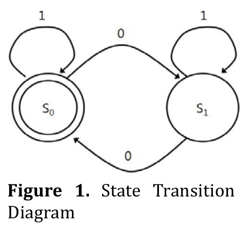
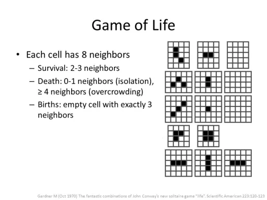
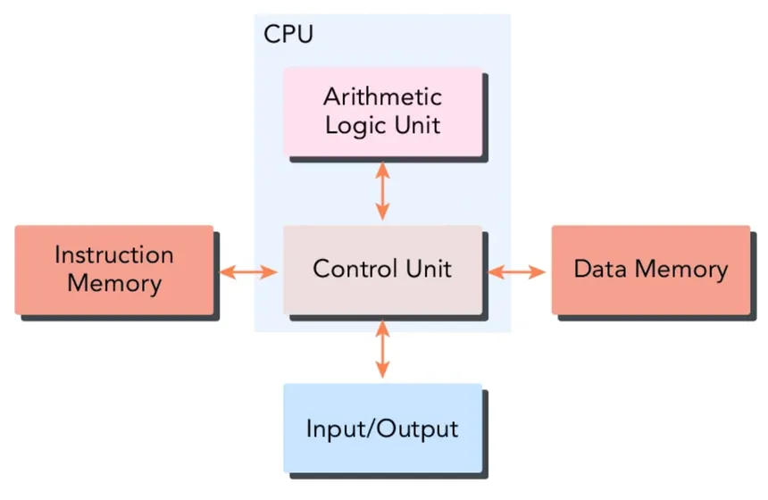
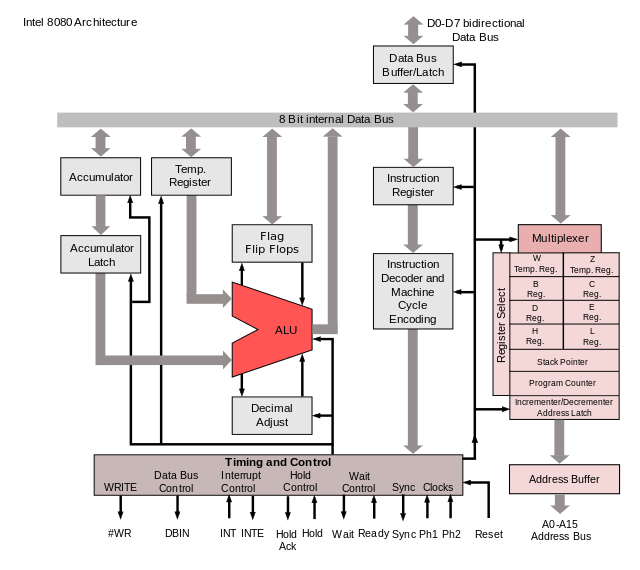

# Introduction to CPU Architecture

SSgt Clark, Athan L

_Presented on 20251211_

---

# SSgt Clark

Platoon Sergeant
3D Network Battalion, Detachment Hawaii

- Software Developer for ~15 Years
- Software Engineering & Computer Science Enthusiast
    - Working Toward Degree and PE Licensure
- CompTIA A+, Net+, Sec+, CySA+
- Google Data Analytics, Professional Scrum Master Level 1
- Lean Six Sigma Yellow Belt

---

## Outline

1. Introduction
2. Boolean Electronics
3. Binary Encoding
4. Digital Electronics
5. Memory
6. Theory of Computing
7. Trivial CPU and Assembly
8. Effect of Operating Systems, Multi-Core, Multi-Thread, RISC vs. CISC, Tiers of Caches, pipelines, look-ahead, branch prediction, etc.
8. Conclusion

- show that 2^32 ~ 4 billion, 2^64 is a shitload more


---

## Introduction

> The processor controls the operation of the computer and performs its data processing functions. When there is only one processor, it is often referred to as the central processing unit (CPU).

— <u>Computer Organization and Architecture</u> by William Stallings

---

## Boolean Logic

$$ Boolean := True | False $$
- $x \land y \approx$ "both $x$ and $y$ are $True$"
- $x \lor y \approx$ "either $x$ and $y$ are $True$"
- $x \veebar y \approx$ "either $x$ and $y$ are $True$, but not both" (_exclusive_ or)
- $\overline{x} \approx$ "not $x$" (make it the opposite)

---

## Boolean Electronics

- Truthiness of a Boolean value is represented as a signal - Voltage
    - High Voltage $:= True$
    - Low Voltage $:= False$

<div class="columns strech">

```tikz
\documentclass{article}
\usepackage{tikz}
\usepackage{circuitikz}
\usepackage{amssymb}
\begin{document}
\begin{circuitikz} 
\draw
(0,2)         node (myand1) [xshift=1cm,and port]           {}
(myand1.out)  node      [anchor=south west]             {$A \land B$}
(myand1.in 1) node (A1)     [anchor=east,xshift=-1cm]           {A}
(myand1.in 2) node (B1)     [anchor=east,xshift=-1cm,yshift=-.7cm]  {B} 
(0,0)         node (mynot1) [not port, scale=.5]            {} 
(mynot1.out)  node      [anchor=south west]             {$\bar{B}$}
(2.5,-.280)   node (myor1)  [or port]                   {}
(myor1.out)   node      [anchor=south west,xshift=.05cm]        {$\bar{B} \lor C$}
(4,1.72)      node (myor2)  [xor port]                   {}
(myor1.in 2)  node (C1)     [anchor=east,xshift=-2.5cm]         {C}
(myor2.out)   node      [anchor=south west]             {$(A \land B) \veebar (\bar{B} \lor C)$};

\draw (myor2.out) -- ++(1cm,0);
\draw (myand1.in 2) |- (mynot1.in);
\draw (mynot1.out) -| (myor1.in 1);
\draw (myand1.out) -- (myor2.in 1);
\draw (myor1.out) -- (myor2.in 2);
\draw (myand1.in 1) -- (A1);
\foreach \Point in {(A1),(B1), (C1)}{
    \node [xshift=.2cm] at \Point {\textbullet};
}
\node [xshift=1.25cm] at (B1) {$\bullet$};
\node [xshift=1cm] at (myor2.out) {$\bullet$};
\draw (B1) -- ++(1.25cm,0);
\draw (myor1.in 2) -- (C1);
\end{circuitikz}
\end{document}
```

<div>

- Gates process signals to create new ones
- Functionally identical to the logical expressions

</div>

</div>

---

## Binary Encoding

$$ True = \mathrm{HIGH} = 1 $$
$$ False = \mathrm{LOW} = 0 $$

Binary Digit, or "Bit"

$$ 1 \land 0 = 0 $$
$$ 0 \lor 1 = 1 $$
$$ 1 \veebar 1 = 0 $$
$$ \bar{1} = 0 $$

---

## Binary Encoding

> How do we represent values other than Booleans?

### Integers

Depth of 1 bit

| Bit 1 | Result Value |
| :---  | :--------    |
| 0     | 0            |
| 1     | 1            |

---

## Binary Encoding

> How do we represent values other than Booleans?

### Integers

Depth of 2 bits

<small>

| Bit 2 | Bit 1 | Result Value |
| :---  | :---  | :--------    |
| 0     | 0     | 0            |
| 0     | 1     | 1            |
| 1     | 0     | 2            |
| 1     | 1     | 3            |

</small>

---

## Binary Encoding

> How do we represent values other than Booleans?

<div class="columns">

<div>

### Integers

Depth of 3 bits

> Notice the direction of "most significant bit"

- Big-endian vs. Little-endian

</div>

<div>

<small>

| Bit 3 | Bit 2 | Bit 1 | Result Value |
| :---  | :---  | :---  | :--------    |
| 0     | 0     | 0     | 0            |
| 0     | 0     | 1     | 1            |
| 0     | 1     | 0     | 2            |
| 0     | 1     | 1     | 3            |
| 1     | 0     | 0     | 4            |
| 1     | 0     | 1     | 5            |
| 1     | 1     | 0     | 6            |
| 1     | 1     | 1     | 7            |

</small>

</div>

</div>

---

## Binary Encoding

> How do we represent values other than Booleans?

### Integers

Total number of possible values is 2 to the power of the bit depth

<small>

$$ 2^b $$
$$ 2^3 = 8 $$
$$ 2^{32} = 4,294,967,296 $$
$$ 2^{64} = 18,446,744,073,709,551,616 $$

</small>

---

## Binary Encoding

> How do we represent values other than Booleans?

### Decimals

- IEEE 754 Specification - "Floating-Point" Numbers

Modeled after Scientific Notation

$$ \pm Decimal \times 10^{Exponent} $$

One bit for the sign (+ or -), a handful for the exponent, the rest for the decimal

---

## Binary Encoding

> How do we represent values other than Booleans?

### Strings

- ASCII - 8 bits (one byte) per character
- Didn't Include Other Languages
- ISO 8859 Was Garbage
- Unicode Developed - UTF-8/16/32 (UTF-8 is most popular)

---

## Binary Encoding

> A note on Bits and Bytes

- A Bit is one binary digit
- A Byte is 8 bits (unless you live in the '70s)
- A _Word_ is whatever the bit depth of the machine you're using
    - Computers from the 2010's might often be 32-bit
    - Most machines today are 64-bit

---

# Are We Good?

---

# Are We Good?

## Cool.

---

## Digital Electronics

Boolean Logic at the Byte / Word level

<div class="tiny">

| Byte A | Byte B | Result |
| :----- | :----- | -----: |
| 0 | 0 | 0 |
| 1 | 0 | 1 |
| 0 | 0 | 0 |
| 1 | 1 | 0 |
| 1 | 0 | 1 |
| 0 | 1 | 1 |
| 0 | 0 | 0 |
| 1 | 1 | 0 |

</div>

---

## Digital Electronics

Circuitry for Arithmetic

<div class="tiny">

| Byte A | Byte B | Result |
| :----- | :----- | -----: |
| 0 | 0 | 1 |
| 1 | 1 | 0 |
| 0 | 0 | 0 |

</div>

- Add, Subtract, Multiply, Divide for Integers / Floats
- Trigonometry, Exponents for Floats

---

## Digital Electronics

### Other Important Ideas

Flip-Flops:

- Stays in a state after a signal is removed
- Foundation for Memory

Clock:

- Oscillations give circuits a metronome

---

## Memory

Examples of Memory

<small>

- Hard Disk
- Solid-State Drive
- Floppy Disk
- Compact Disk
- Random-Access Memory
- Flash Memory
- Read-Only Memory
- CPU Cache
- CPU Register

</small>

---

## Memory

Ranks of Memory

- CPU Register - Single Word
- CPU Cache - Handful of Words
- Volatile Memory - Lots of Words, Accessed through "Pages"
- Persistent Memory - Tons of Words, Accessed through "Blocks" and "Sectors"

---

## Memory

Memory Addresses

- Example: An array of 100 numbers

```js
[12, 4, 54, 23, ... ,34, 9]
```

- Value at index `0`: 12
- Value at index `2`: 54
- Value at index `99`: 9

In Real-Life, **words** of Memory are indexed by **words**

---

# We O.K.?

---

# We O.K.?

## Cool.

---



## Theory of Computing

Turing Machine

- Discrete Tape of Glyphs
- Machine that has a Read / Write head
    - Can seek Left / Right #-of-steps
    - Reads & Writes Glyhps
    - I/O Defined WRT Read / Write
    - Can have a "State"

---



## Theory of Computing

Finite State Automata

- Discrete States as "Nodes"
    - One Identified as "Start State"
- Edges Between Nodes are Transitions
- Transition Event = Read Event

---



## Theory of Computing

Conway's Game of Life

- 2-Dimensional Tape
- 2 Glyphs (On or Off)
- Instructions Affect Neighbor Tape Positions

---


## High-Level Computer Design

Von Neumann Architecture

- Explicit I/O Devices
- Pool of Memory = Tape
- CPU = Machine with Read / Write head
- General Purpose

---



## High-Level Computer Design

Harvard Architecture

- Very Similar to Von Neumann
- Separate Data vs. Instruction Pools
- Intended use - Microcontrollers

---

# Check-In - Are We Okay?

---

# Check-In - Are We Okay?

## Cool.

---

## Trivial CPU

Requirements

<div class="tiny">

| Requirement | Solution |
| :---------- | --------: |
| Must be able to **Store** Some Data | Registers |
| Must be able to Interact with **Memory** | Memory Unit & Memory Address Register |
| Must be able to **Perform** an Instruction on Registers | Arithmetic and Logic Unit & Accumulator |
| Must be able to **Identify Which Instruction** to Perform | Instruction Register |
| Must be able to Point to the **Next Instruction** in Memory | Program Counter |
| Must be able to **Conditionally** set the next instruction based on the results of the current instruction | Flags |
| Must be able to **Move Data** from one Register to another | Control Unit |
| Events have to be **Synchronized** | Timing Unit |

</div>

---

## Trivial CPU

### Registers

<small>

- Store a Word
- Takes 1 "Clock Cycle" to Access
- Any Other Component Can Read It

Some are General Purpose for Data Processing, or Special Purpose

- Memory Access Register Stores Address in Memory to Read / Write
- Instruction Register Stores Glyph Representing Current Action to Perform
- Program Counter Stores Address of Next Instruction Stored in Memory
- Accumulator Stores Results of Arithmetic & Logic Unit

</small>

---

## Trivial CPU

### Memory

- Pool of Data (Words of Data)
- Read / Write Access
- Indexed by a Word (Address)

---

## Trivial CPU

### Arithmetic Logic Unit (ALU)

- Can perform Arithmetic on Words (Integers / Floats)
- Can perform Logic on Words (Boolean)
- Results are stored in Accumulator
- Typically one of the Inputs is also from the Accumulator (overwrites when action is performed)
- Action to be performed identifed by Instruction Register

---

## Trivial CPU

### Instruction

Like in a Turing Machine, Reading a specific Glyph causes a Specific Action

- `00110101` $\rightarrow$ "Add Accumulator and Register 1, store to Accumulator"
- `00111101` $\rightarrow$ "Copy Register 1 into Register 2"
- `11010110` $\rightarrow$ "Read the value of memory at Memory Address Register, store into Register 3"

---

## Trivial CPU

### Instruction Register

Either ALU, Memory Unit, or Control Unit performs Instruction stored in IR on the current clock cycle

- Write Only

---

## Trivial CPU

### Program Counter

- Points to the next instruction stored in Memory
- PC holds an _address_ in memory
- If left untouched, the CPU automatically increases this value after every clock cycle (goes to the next sequential instruction)

---

## Trivial CPU

### Flags

- Built-in system to branch into a different set of instructions based on the condition of some result
- How "if $X$ then $Y$ else $Z$" runs under-the-hood, where $Y$ and $Z$ are new starting locations for more instructions in memory, and $X$ is some condition to test

---

## Trivial CPU

### Control Unit

- Facilitates copying data from one register to another, or from/to memory

$$ R_1 \leftarrow Acc $$
$$ M[MAR] \leftarrow R_2 $$
$$ Acc \leftarrow M[MAR] $$

---

## Trivial CPU

### Timing Unit

- Oscillator ticks once every clock cycle
- Modern CPUs operate at the $>2 GHz$ range
- Each clock cycle can do one of these things
    - facilitate copying data from one register to another
    - perform arithmetic on the accumulator and some other register
    - fetch the next instruction
    - increment the program counter

---



## Trivial CPU

---

# How are we holding up?

---

# How are we holding up?

## Cool.

---

## Implications of Operating Systems

- Time Sharing, Context Switching, and Process Schedulers
- Stack Pointers and Function Calls
- Interrupt Requests and Networking
- Memory Management

---

## Video Series

- National Programme on Technology Enhanced Learning (NPTEL) from the Indian Institute of Technology (IIT) - Computer Organization

---

## Conclusion


> Databases are designed to **retain**, **access**, and **manipulate** large amounts of data quickly and **preserve** them indefinitely.

SQL is a popular, decent solution to those problems. You'll likely see it again in your professional career.

Slides are available at [github.com/athanclark/usmc-presentation-databases-20251204](https://github.com/athanclark/usmc-presentation-databases-20251204)

---

# Vote on Next Topic

1. Proxmox Virtualization System
    - great for home labs
2. Haskell Programming Language
    - it's like joining a cult
3. CPU Architecture
    - fun!
4. Abstract Algebra
    - don't be afraid

---

# Questions / Comments
