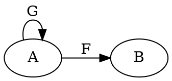

# Introduction to Programming

SSgt Clark, Athan L

_Presented on 20251218_

---

# SSgt Clark

Platoon Sergeant
3D Network Battalion, Detachment Hawaii

- Software Developer for ~15 Years
- Software Engineering & Computer Science Enthusiast
    - Working Toward Degree and PE Licensure
- CompTIA A+, Net+, Sec+, CySA+
- Google Data Analytics, Professional Scrum Master Level 1
- Lean Six Sigma Yellow Belt

---

## Outline

<div class="columns">
<div>

1. Introduction
2. Data and Actions
3. Basic Operations
4. Principle of Organization
5. Functions
6. Paradigms and Semantics

</div>
<div>

7. Composition of Data
8. Algebraic Data Types
9. Objects and OOP
10. Lambda Calculus
11. Type Theory
12. Conclusion

</div>
</div>

---

## Introduction


> Programming is the act of designing a system that runs on another system designed to run systems.

— Me

---

## Data and Actions

Data = "Subject Matter"
Actions = "What I'm Doing With It"



General Ideas

- Data is inert
- Actions typically create data as a result
- Effects - Actions that affect data other than the _subject matter_

---

## Basic Operations

Typically "Built-In" to the programming langauge
$\quad \hookrightarrow$ a globally available "context" when desigining a program

<small>

| Data Types | Operations Supported |
| :-------   | ------------: |
| Numbers | Arithmetic, Trigonometry, Comparison |
| Booleans | Logic |
| Strings | Find-and-Replace, Concatenate/Append, "to lower" / "to upper" |
| Arrays | Same as strings except ambiguous, "Mapping", "Reduce" |
| Tuples | Mapping over Specific Position |
| Most | Equality |

</small>

---

## Principle of Organization

1. Doing a lot of different things can get complicated
2. Organize the actions into sub-actions, group data together
3. Make sure the sub-actions and groups are _"modular"_
4. Modular actions and data groups can now be used as built-ins

Programmers build tools to write programs, they extend and control their **context**

- Is not "endless" - there is an end-state of a "product"

---

## Functions

Means different things in different programming paradigms

- Procedure captured over variables
- Generalized over inputs that remain ambiguous
- Can return results

```hs
square :: Number -> Number
square x = x * x
```

```ts
function square(x: number) -> number {
  return x * x;
}
```

---

## Paradigms and Semantics

<small>

- **"Mutable"** Data - variables that can have their contents mutated / changed
- **"Pure"** Functions - functions that don't cause side-effects
- **"Imperative"** vs. **"Functional"** - sequence of steps vs. composition of results
- **"Compiled"** vs. **"Interpreted"** - CPU executes the program via translation ahead of time, or just-in-time translation via an _interpreter_

</small>

### Types of Data

- Object-Oriented, Mutable Objects that Contain Methods
- Algebraic Data Types, Separate Enumerations and Structures
- Inheritance, Traits, Generics - Means By Which Code Is Shared

---

# Are We Good?

---

# Are We Good?

## Cool.

---

# Install VSCode

[code.visualstudio.com](code.visualstudio.com)

---

# Install Node.js

1. Install NVM-Windows: [github.com/coreybutler/nvm-windows](github.com/coreybutler/nvm-windows)
2. Open PowerShell
3. Verify NVM is installed: `nvm`
4. Install a Long-Term Support Node.js: `nvm install lts`
5. Verify Node.js is installed: `node --version`

---

## JavaScript

- Mutable
- Impure
- Imperative
- Interpreted
- Object-Oriented
- Inheritance

It's widely available (all browsers support it)

---

## Composition of Data

- Data "Contained" Within other _Structures_
- Data that "Inherits" Functionality or Features

### Typical Methods of Encapsulation

- Struct - Tuples
- Enum - "Either $X$ or $Y$" - must be only 1
- "$X$ is a Number" $\implies$ "$X$ supports Arithmetic Operations"

---

## Algebraic Data Types

Structure / Struct:

<small>

<div class="columns">

<div>

Rust:

```rs
struct Foo {
  field_one: i32,
  field_two: String,
}
```

TypeScript:

```ts
type Foo = {
  fieldOne: number,
  fieldTwo: string,
}
```

</div>

<div>

Haskell:

```hs
data Foo = Foo {
  fieldOne :: Integer,
  fieldTwo :: String,
}
```

OOP:

```cpp
class Foo {
  int fieldOne;
  char[] fieldTwo;
}
```

</div>

</div>

</small>

---

## Algebraic Data Types

Enumeration / Enum:

<small>

<div class="columns">

<div>

Rust:

```rs
enum Bar {
  OnePossibility(i32),
  OtherPossibility(String),
  YetAnotherPossibility,
}
```

</div>

<div>

Haskell:

```hs
data Bar
  = OnePossibility Integer
  | OtherPossibility String
  | YetAnotherPossibility
```

</div>

</div>

A `Bar` must be either a `OnePossibility` holding a `i32`/`Integer`, a `OtherPossibility` holding a `String`, or a `YetAnotherPossibility`, which doesn't hold anything.

</small>

---

## Why "Algebraic"?

- Struct = Product
- Enum = Sum

Think about the space of possible values a data type defines - a tuple or a struct multipies the total number of possible values, while an enum just adds them together

- Example: Bit Depth - $2^n$ number of possiblities as `n` grows larger. If it's 2 bits, then it's $2 \times 2$

---

## Why "Algebraic"?

<small>

```hs
data Binary = BZero | BOne -- total possible values = 2
data Trinary = TZero | TOne | TTwo -- total possible values = 3

data BothAtTheSameTime = BothAtTheSameTime Binary Trinary
data EitherOneOrTheOther = JustBinary Binary | JustTrinary Trinary
```

</small>

<div class="columns tiny">

| `Both` possible values | Count |
| :---- | ---: |
| `BothAtTheSameTime BZero TZero` | 1 |
| `BothAtTheSameTime BZero TOne` | 2 |
| `BothAtTheSameTime BZero TTwo` | 3 |
| `BothAtTheSameTime BOne TZero` | 4 |
| `BothAtTheSameTime BOne TOne` | 5 |
| `BothAtTheSameTime BOne TTwo` | 6 |

| `Either` possible values | Count |
| :---- | ---: |
| `JustBinary BZero` | 1 |
| `JustBinary BOne` | 2 |
| `JustTrinary TZero` | 3 |
| `JustTrinary TOne` | 4 |
| `JustTrinary TTwo` | 5 |

</div>

---

# We O.K.?

---

# We O.K.?

## Cool.

---

# Play Around with the REPL

Showcase Basic Operations, Building Objects and Arrays, Methods on Objects

Show Some Basic Rust and Haskell Code

---

## Object-Oriented Programming

- **"Objects"** 
    - Contain Mutable Data (like a Struct)
    - Contain **"Methods"** (actions / functions) that affect its Data
- **"Classes"** Defines Types of Objects
- **"Instances"** Are the Objects Themselves

```cpp
x = new Foo();
x.runSomeMethod();
subData = x.accessSomeField;
```

---

## Lambda Calculus

<small>

Way of Writing Functions Short-Hand


$$ \lambda x. x + 5 $$

```js
function add5(x) {
  return x + 5;
}
```

Higher-Order Functions

</small>

$$ \lambda f x. f(x) $$

> Give me a function and a value and I'll apply that function to the value

---

## Lambda Calculus

<small>

Way of Writing Functions Short-Hand

$$ \lambda x. x + 5 $$

```js
function add5(x) {
  return x + 5;
}
```

Higher-Order Functions

</small>

$$ \lambda f x. f(x) $$
$$ \lambda f x. f \space x $$

---

## Why Lambda Calculus?

In $\lambda$, functions are treated as data - functions can be returned from functions, functions can be passed to functions

Many programming languages' `function` keyword aren't lambdas, but they do support lambdas in different ways:

- Rust and Ruby is `|x| x + 5`
- JavaScript is `x => x + 5`
- C++ is weird, idk how it works
- Haskell uses lambdas natively

---

## Type Theory

A fancy way of asking and finding out "what data type is this?"

Rust:

```rs
fn foo(x: i32) -> bool {
  //...
}
```

TypeScript:

```ts
function foo(x: number) -> boolean {
  // ...
}
```

---

## Type Theory

Untyped Lambda Calculus

$$ \lambda x. x + 5 $$

Simply Typed Lambda Calculus

$$ \lambda x: Number. x + 5 $$

---

## Type Theory

Untyped Lambda Calculus

$$ \lambda x. x + 5 $$

Simply Typed Lambda Calculus

$$ \lambda x: Number. x + 5 $$
$$ f := \lambda x: Number. x + 5 $$

---

## Type Theory

Untyped Lambda Calculus

$$ \lambda x. x + 5 $$

Simply Typed Lambda Calculus

$$ \lambda x: Number. x + 5 $$
$$ (\lambda x: Number. x + 5) : Number \rightarrow Number $$
$$ f := \lambda x: Number. x + 5 $$
$$ f : Number \rightarrow Number $$

---

## Type Theory

Generic Types - Type Variables

$$ g := \lambda x. x $$

What is the type of $g$?

---

## Type Theory

Generic Types - Type Variables

$$ g := \lambda x: \alpha. x $$

What is the type of $g$?

---

## Type Theory

Generic Types - Type Variables

$$ g := \lambda x: \alpha. x $$

What is the type of $g$?

$$ g : \alpha \rightarrow \alpha $$

---

## Type Theory

Generic Types - Type Variables

$$ g := \lambda x: \alpha. x $$

What is the type of $g$?

$$ g : \alpha \rightarrow \alpha $$

$\alpha$ is a _type variable_

---

## Type Theory

Generic Types - Type Variables

$$ g := \lambda x: \alpha. x $$

What is the type of $g$?

$$ g : \alpha \rightarrow \alpha $$

$\alpha$ is a _type variable_ - doesn't that mean we should introduce it with a lambda?

---

## Type Theory

Generic Types - Type Variables

$$ g := \forall \alpha. \lambda x: \alpha. x $$

What is the type of $g$?

$$ g : \forall \alpha. \alpha \rightarrow \alpha $$

$\alpha$ is a _type variable_ - doesn't that mean we should introduce it with a lambda?

---

## Type Theory

Generic Types - Type Variables

$$ g := \forall \alpha. \lambda x: \alpha. x $$

What is the type of $g$?

$$ g : \forall \alpha. \alpha \rightarrow \alpha $$

$\alpha$ is a _type variable_ - doesn't that mean we should introduce it with a lambda?

```hs
g :: forall a. a -> a
g x = x
```

---

# How are we holding up?

---

# How are we holding up?

## Cool.

---

## Further Information

- There is so much further information, literally just google anything about the language you want to learn
- Almost every language has their documentation online for free
- People compete with each other like influencers to make information more available

---

## Conclusion


> Good programmers are good at writing programs. Great programmers are good at designing programs. The best programmers are mathematicians.

Slides are available at [github.com/athanclark/usmc-presentation-programming-20251218](https://github.com/athanclark/usmc-presentation-programming-20251218)

---

# Vote on Next Topic

1. Proxmox Virtualization System
    - great for home labs
2. Abstract Algebra
    - don't be afraid
3. Shells
    - 🐚
4. GNU/Linux
    - This one won't get you anywhere, but you'll be able to say that you were made aware of some things

---

# Questions / Comments
